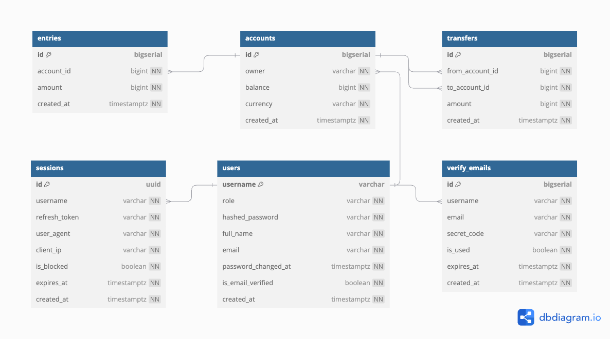

<a name="readme-top"></a>

# <p align="center">A Simple Bank</p>

<p align="center">
    
    
    
    
    
    
    
    
    
    
    
    
</p>

## 💬 About

This project was developed following Udemy's "[Backend Master Class [Golang + Postgres + Kubernetes + gRPC]](https://www.udemy.com/course/backend-master-class-golang-postgresql-kubernetes/)" class.

The project is a simple bank system that allows you to create accounts, deposit and withdraw money, and transfer money between accounts.



Notes taken during the course are in the [notes](notes.md) file.

## :computer: Technologies

- [Go](https://golang.org/)
- [Gin](https://gin-gonic.com/)
- [Viper](https://github.com/spf13/viper)
- [Statik](https://github.com/rakyll/statik)
- [PostgreSQL](https://www.postgresql.org/)
- [Lib pq](https://github.com/lib/pq)
- [SQLC](https://sqlc.dev/)
- [Testify](https://github.com/stretchr/testify)
- [mockgen/gomock](https://github.com/uber-go/mock)
- [gRPC](https://grpc.io/)
- [Docker](https://www.docker.com/)
- [Kubernetes](https://kubernetes.io/)
- [JWT](https://jwt.io/)
- [PASETO](https://paseto.io/)
- [AWS](https://aws.amazon.com/)
- [Swagger](https://swagger.io/)

<p align="right">(<a href="#readme-top">back to top</a>)</p>

## :scroll: Requirements

- [Docker](https://www.docker.com/)
- [Go](https://golang.org/)
- [Golang Migrate](https://github.com/golang-migrate/migrate/tree/master/cmd/migrate)

<p align="right">(<a href="#readme-top">back to top</a>)</p>

## :cd: Installation

```sh
git clone git@github.com:filipe1309/ud-bmc-simplebank.git
```

```sh
cd ud-bmc-simplebank
```

If you don't want to use docker, you can install the project dependencies and create the database with:

```sh
make install
```
> This will run the commands: `make createdb` and `make migrateup`.  
> This will install the project dependencies and create the database.  
> The database will be available at `localhost:5432` with:
> - user: `root`
> - password: `secret`
> - database: `simple_bank`


<p align="right">(<a href="#readme-top">back to top</a>)</p>

## :runner: Running

With docker:

```sh
make run
```

Without docker:

```sh
make postgres
```

```sh
make server
```

> This will run the server at `localhost:8080` and the database at `localhost:5432`.


<p align="right">(<a href="#readme-top">back to top</a>)</p>

## :rocket: Usage

> defined in `main.go`

### API - Gin

| API | Name | Rule |
| --- | --- | --- |
| `POST /users/login` | Login | A user can log in with email and password |
| `POST /tokens/renew-access-token` | Renew access token | A user can renew his/her access token with a valid refresh token |
| `POST /users` | Create a new user | A user can create a new user |
| `POST /accounts` | Create a new account | A logged user can only create an account for himself/herself |
| `GET /accounts/:id` | Get an account by id | A logged user can only get accounts that belong to himself/herself |
| `GET /accounts` | List accounts | A logged user can only list accounts that belong to himself/herself |
| `POST /transfers` | Create a new transfer | A logged user can only send money from his/her account |

Examples of the API requests are in the [api](api.http) file.

> Docs http://localhost:8080/swagger/

### API - gRPC Gateway

| API | Name | Rule |
| --- | --- | --- |
| `POST /v1/login_user` | Login | A user can log in with email and password |
| `POST /v1/create_user` | Create a new user | A user can create a new user |
| `POST /v1/update_user` | Update a user | A logged user can only update his/her own user, username is required and other fields are optional |

Examples of the API requests are in the [api_grpc_gateway](api_grpc_gateway.http) file.

> Docs http://localhost:8080/swagger/

### gRPC

| gRPC | Name | Rule |
| --- | --- | --- |
| `LoginUser` | Login | A user can log in with email and password |
| `CreateUser` | Create a new user | A user can create a new user |
| `UpdateUser` | Update a user | A logged user can only update his/her own user, username is required and other fields are optional |

Example with Evans REPL:

```sh
make evans
```

```sh
> call LoginUser
# {
#     "username": "johndoe5",
#     "password": "secret"
# }
```

```sh
> call CreateUser
# {
#   "username": "johndoe5",
#   "full_name": "John Doe Five",
#   "email": "john.doe5@email.com",
#   "password": "secret"
# }
```

```sh
> call UpdateUser
# {
#   "username": "johndoe5", # required
#   "full_name": "New John Doe Five",
#   "email": "john.doe5@email.com",
#   "password": "secret"
# }
# OR
# {
#   "username": "johndoe5",
#   "full_name": "New John Doe Five"
# }
```

<p align="right">(<a href="#readme-top">back to top</a>)</p>


## :white_check_mark: Tests

```sh
make test
```

<p align="right">(<a href="#readme-top">back to top</a>)</p>


## :memo: License

[MIT](https://choosealicense.com/licenses/mit/)

<p align="right">(<a href="#readme-top">back to top</a>)</p>

## 🧙‍♂️ About Me

<p align="center">
    <a style="font-weight: bold" href="https://github.com/filipe1309/">
    
    </a>
</p>

<p align="right">(<a href="#readme-top">back to top</a>)</p>

---

<p align="center">
    Done with&nbsp;&nbsp;♥️&nbsp;&nbsp;by <a style="font-weight: bold" href="https://github.com/filipe1309/">Filipe Leuch Bonfim</a> 🖖
</p>

---

## :clap: Acknowledgments

- [Simple Bank Repo](https://github.com/techschool/simplebank)
- [Backend Master Class [Golang + Postgres + Kubernetes + gRPC]](https://www.udemy.com/course/backend-master-class-golang-postgresql-kubernetes/)
- [Simple Bank DBDocs](https://dbdocs.io/techschool.guru/simple_bank)
- [TablePlus](https://tableplus.com/)
- [ShubcoGen Template™](https://github.com/filipe1309/shubcogen-template)
- [Golang Migrate CLI Repo](https://github.com/golang-migrate/migrate/tree/master/cmd/migrate)
- [DBML](https://dbml.dbdiagram.io/docs/)
- [Gorm](https://gorm.io/)
- [SQLX](https://jmoiron.github.io/sqlx/)
- [SQLC](https://sqlc.dev/)
- [Lib pq](https://github.com/lib/pq)
- [Testify](https://github.com/stretchr/testify)
- [PostgreSQL Wiki - Lock Monitoring](https://wiki.postgresql.org/wiki/Lock_Monitoring)
- [Creating PostgreSQL service containers](https://docs.github.com/en/actions/using-containerized-services/creating-postgresql-service-containers)
- [Gin](https://gin-gonic.com/)
- [Viper](https://github.com/spf13/viper)
- [Go Package Validator](https://github.com/go-playground/validator)
- [JWT](https://jwt.io/)
- [Golang JWT](https://github.com/golang-jwt/jwt)
- [PASETO](https://paseto.io/)
- [Golang PASETO](https://github.com/o1egl/paseto)
- [VSCode REST Client](https://marketplace.visualstudio.com/items?itemName=humao.rest-client)
- [Docker hub golang](https://hub.docker.com/_/golang/)
- [Docker hub postgres](https://hub.docker.com/_/postgres/)
- [Wait-for script](https://github.com/eficode/wait-for)
- [Docker compose](https://docs.docker.com/compose/)
- [AWS free tier](https://aws.amazon.com/free/)
- [Creating a container image for use on Amazon ECS](https://docs.aws.amazon.com/AmazonECS/latest/developerguide/create-container-image.html)
- [Amazon ECR "Login" Action for GitHub Actions](https://github.com/marketplace/actions/amazon-ecr-login-action-for-github-actions)
- [Connecting GitHub Actions To AWS Using OIDC](https://www.youtube.com/watch?v=mel6N62WZb0&ab_channel=StratusGrid)
- [Configuring OpenID Connect in Amazon Web Services](https://docs.github.com/en/actions/deployment/security-hardening-your-deployments/configuring-openid-connect-in-amazon-web-services)
- [Install or update to the latest version of the AWS CLI](https://docs.aws.amazon.com/cli/latest/userguide/getting-started-install.html)
- [jq](https://stedolan.github.io/jq/)
- [AWS get-login-password](https://docs.aws.amazon.com/cli/latest/reference/ecr/get-login-password.html)
- [Kubernetes](https://kubernetes.io/)
- [Kubernetes Install Tools kubectl](https://kubernetes.io/docs/tasks/tools/)
- [How do I provide access to other IAM users and roles after cluster creation in Amazon EKS/?](https://repost.aws/knowledge-center/amazon-eks-cluster-access)
- [Grant IAM users access to Kubernetes with EKS access entries](https://docs.aws.amazon.com/eks/latest/userguide/access-entries.html#creating-access-entries)
- [K9s](https://k9scli.io/)
- [Kubernetes Deployments](https://kubernetes.io/docs/concepts/workloads/controllers/deployment/)
- [ENI Max Pods](https://github.com/aws/amazon-vpc-cni-k8s/blob/master/misc/eni-max-pods.txt)
- [Maximum IP addresses per network interface](https://docs.aws.amazon.com/AWSEC2/latest/UserGuide/AvailableIpPerENI.html)
- [Kubernetes Services](https://kubernetes.io/docs/concepts/services-networking/service/)
- [Kubernetes Ingress](https://kubernetes.io/docs/concepts/services-networking/ingress/)
- [Kubernetes Ingress Controller](https://kubernetes.io/docs/concepts/services-networking/ingress-controllers/)
- [Kubernetes Ingress Nginx](https://kubernetes.github.io/ingress-nginx/)
- [Ingress-Nginx Controller](https://kubernetes.github.io/ingress-nginx/deploy/#aws)
- [A complete overview of SSL/TLS and its cryptographic system](https://www.youtube.com/watch?v=-f4Gbk-U758)
- [Kubernetes TLS](https://kubernetes.io/docs/concepts/services-networking/ingress/#tls)
- [cert-manager](https://cert-manager.io/docs/)
- [Let's Encrypt](https://letsencrypt.org/)
- [Kubectl tool installer](https://github.com/marketplace/actions/kubectl-tool-installer)
- [vscode-dbml](https://marketplace.visualstudio.com/items?itemName=matt-meyers.vscode-dbml)
- [dbdocs.io](https://dbdocs.io/docs)
- [gRPC](https://grpc.io/)
- [Protocol Buffer Compiler Installation](https://grpc.io/docs/protoc-installation/)
- [Language Guide (proto 3)](https://protobuf.dev/programming-guides/proto3/)
- [vscode-proto3](https://marketplace.visualstudio.com/items?itemName=zxh404.vscode-proto3)
- [Evans: gRPC CLI](https://github.com/ktr0731/evans)
- [Conventional Commits](https://www.conventionalcommits.org/en/v1.0.0/)
- [gRPC-Gateway](https://github.com/grpc-ecosystem/grpc-gateway)
- [Google APIs](https://github.com/googleapis/googleapis)
- [Customizing your gateway](https://grpc-ecosystem.github.io/grpc-gateway/docs/mapping/customizing_your_gateway/)
- [Swagger](https://swagger.io/)
- [Swagger Editor](https://editor-next.swagger.io/)
- [SwaggerHub](https://swagger.io/tools/swaggerhub/)
- [gRPC-Gateway - a_bit_of_everything.proto](https://github.com/grpc-ecosystem/grpc-gateway/blob/main/examples/internal/proto/examplepb/a_bit_of_everything.proto)
- [Swagger UI](https://swagger.io/tools/swagger-ui/)
- [Statik](https://github.com/rakyll/statik)

<p align="right">(<a href="#readme-top">back to top</a>)</p>
